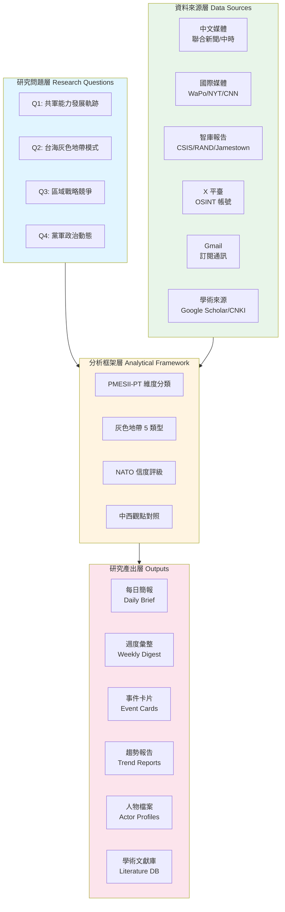
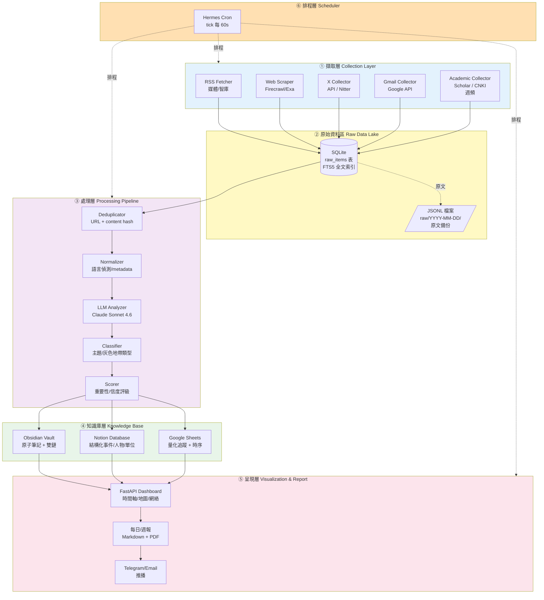
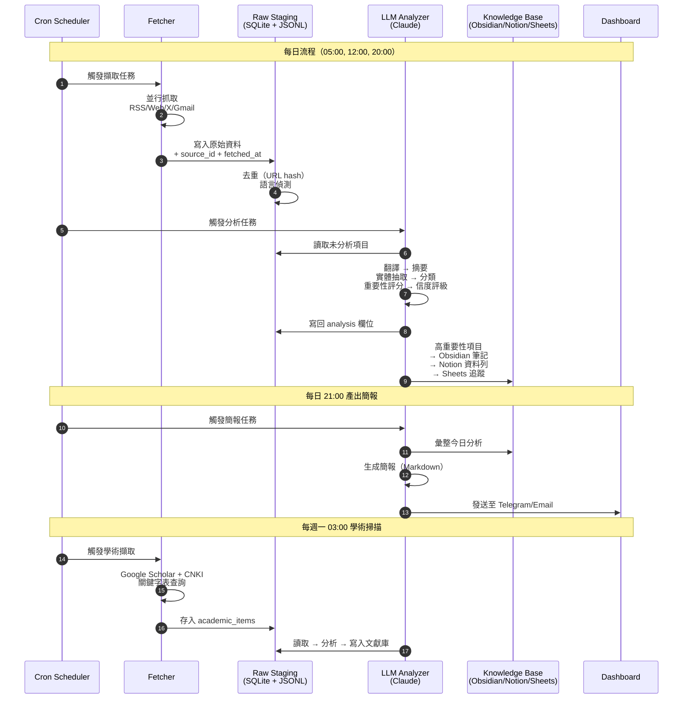

# PLA Watch — 中共軍事動態與灰色地帶衝突研究系統

**建立日期**：2026-04-15
**狀態**：設計審閱中（待討論後進入實作）
**分支**：`claude/military-research-system-yw7M4`
**基礎框架**：Hermes Agent

---

## 一、研究背景與目的

### 1.1 研究動機

中共軍事現代化與對外軍事行動節奏自 2020 年代以來顯著加速，特別是：

- **台海軍事壓力常態化**：軍機越中線、海警執法化、聯合利劍系列演習已成為台海安全的結構性威脅
- **灰色地帶行動多樣化**：資訊戰、法律戰、海底電纜威脅、經濟脅迫等手段交織運用
- **軍事透明度低**：共軍人事、裝備發展、軍改細節多需要透過開源情報（OSINT）拼湊
- **資訊碎片化**：相關訊息分散於中文/英文/日文媒體、智庫報告、學術期刊、社群平台（特別是 X）

目前研究者面臨的痛點：
1. 每日需人工瀏覽數十個資訊來源，無系統化記錄
2. 中西方觀點對照困難（CNKI 學術文獻 vs. CSIS/RAND 智庫）
3. 缺乏長期事件時序與趨勢分析能力
4. 原始資料與分析產出未有效分離，難以回溯驗證

### 1.2 研究目的

建立一套**自動化 OSINT 研究系統**，具備以下能力：

1. **主動擷取**多源資料（媒體、智庫、學術、社群、私人訂閱）
2. **原始資料保存**（raw data staging）提供事後驗證與回溯
3. **LLM 輔助分析**：翻譯、實體抽取、主題分類、信度評級
4. **結構化知識庫**：可檢索、可視覺化、可匯出論文引用
5. **週期性產出**：每日簡報、週報、月度趨勢、事件卡片、人物檔案

### 1.3 研究範疇

| 主題域 | 子議題 |
|--------|--------|
| **共軍現代化** | 海空火箭軍裝備、無人系統、AI 軍事化、軍改、聯合作戰指揮 |
| **台海動態** | 機艦擾台、聯合利劍演習、海警執法、海底電纜威脅 |
| **灰色地帶** | 認知戰、資訊戰、法律戰、經濟脅迫、網路攻擊 |
| **區域安全** | 南海、東海、第一/第二島鏈、美中戰略競爭 |
| **黨軍政治** | 中央軍委、戰區人事、反腐整肅、黨軍關係 |

### 1.4 分析框架

採用三層混合分析框架：

1. **PMESII-PT**（Political, Military, Economic, Social, Information, Infrastructure, Physical environment, Time）作為事件分類底層
2. **Hicks/CSIS 灰色地帶五類型**：外交、資訊、軍事、經濟、網路
3. **NATO Admiralty Code** 信度評級：來源可信度（A-F）× 資訊可信度（1-6）

---

## 二、研究架構圖



---

## 三、系統架構圖



---

## 四、資料流圖



---

## 五、資料來源與擷取策略

| 來源 | 擷取方式 | 頻率 | 技術備註 |
|------|----------|------|----------|
| **聯合新聞網軍事** | RSS + Firecrawl 補齊內文 | 每 4 小時 | 有 RSS feed |
| **中時軍武頻道** | RSS + Firecrawl | 每 4 小時 | 需爬蟲補內文 |
| **WaPo / NYT / CNN** | RSS（國安/軍事專欄） | 每 4 小時 | 付費牆以摘要為主 |
| **CSIS / RAND / Jamestown / IISS / ASPI / USIP** | RSS + PDF 下載 | 每日 | PDF 交 Claude Vision 解析 |
| **X 平臺** | Twitter API v2 **或** Nitter scraping | 每 30 分鐘 | **需討論：API 費用 vs. 穩定性** |
| **Gmail** | Google API（OAuth） | 每小時 | **需討論：label/filter 範圍** |
| **Google Scholar** | `scholarly` 套件 / SerpAPI | **每週一 03:00** | 限速、關鍵字表 |
| **CNKI 中國知網** | CNKI Scholar 國際版題錄爬取 | **每週一 03:00** | 僅題錄+摘要；有反爬風險 |

### 關鍵字表（初版，可擴充）

**中文**：中國人民解放軍、共軍、東部戰區、海警、聯合利劍、軍委、灰色地帶、認知戰、反介入、聯合作戰、無人機蜂群
**英文**：PLA, PLAN, PLAAF, PLARF, gray zone, Taiwan Strait, coast guard, joint sword, A2AD, CCP military, coercion

---

## 六、原始資料區設計（Raw Data Lake）

### 6.1 為何需要原始資料區

- **可驗證性**：分析結論可回溯至原文
- **可重跑**：分析 prompt 調整後可重新分析歷史資料
- **學術誠信**：引用可附原文連結 + 擷取時間戳
- **離線備援**：即使來源站台下架，仍保有備份

### 6.2 雙層儲存

**Layer 1: SQLite 結構化索引**（`~/.hermes/research/pla-watch/raw.db`）

```sql
CREATE TABLE raw_items (
    id              INTEGER PRIMARY KEY,
    source_type     TEXT,           -- rss/web/x/gmail/scholar/cnki
    source_id       TEXT,           -- e.g. 'udn_military', 'csis', '@dclingcui'
    url             TEXT,
    url_hash        TEXT UNIQUE,    -- 去重
    content_hash    TEXT,           -- 內文去重
    title           TEXT,
    author          TEXT,
    published_at    TIMESTAMP,
    fetched_at      TIMESTAMP,
    language        TEXT,
    raw_text        TEXT,           -- 完整原文
    raw_html        TEXT,           -- 原始 HTML（可選）
    metadata_json   TEXT,           -- 額外欄位（標籤、引用數等）
    analyzed        INTEGER DEFAULT 0,
    analysis_json   TEXT            -- LLM 分析結果
);

CREATE VIRTUAL TABLE raw_items_fts USING fts5(
    title, raw_text, content='raw_items'
);
```

**Layer 2: JSONL 原文歸檔**（`~/.hermes/research/pla-watch/raw/YYYY-MM-DD/<source>.jsonl`）

- 每日分檔、每來源一檔
- 純文字格式，方便 `grep`、備份、Git 版控
- 即使 SQLite 損毀也可重建

---

## 七、知識庫輸出設計

### 7.1 Obsidian Vault（原子筆記 + 雙向連結）

路徑：`~/PLA-Watch-Vault/`

```
PLA-Watch-Vault/
├── 00-Inbox/                    # 每日原始擷取未處理
├── 10-Events/                   # 重要事件卡片（一事件一筆記）
│   └── 2026-04-15-東部戰區聯合演習.md
├── 20-Actors/                   # 人物/單位檔案
│   ├── 東部戰區.md
│   └── 何衛東.md
├── 30-Themes/                   # 主題索引（MOC）
│   ├── 灰色地帶行動.md
│   └── 火箭軍動態.md
├── 40-Literature/               # 學術文獻（含 BibTeX）
├── 50-Briefs/                   # 每日/週/月簡報
└── 99-Sources/                  # 來源連結清單
```

每張事件卡片含：YAML frontmatter（日期、主題、信度、來源）+ 原文引用 + 分析段落 + `[[雙向連結]]`

### 7.2 Notion Database（結構化查詢）

五張資料庫：

1. **Events**：日期、標題、主題（multi-select）、PMESII-PT、信度、重要性、來源、連結
2. **Actors**：姓名/單位、類型、職位、關聯事件（relation）
3. **Sources**：來源名稱、類型、可信度評級、近 30 日擷取數
4. **Literature**：題目、作者、期刊、年份、引用數、主題、摘要、全文連結
5. **Briefs**：日期、類型、摘要、關聯事件（relation）

### 7.3 Google Sheets（量化追蹤 + 快速視覺化）

- **Daily Counts**：各來源每日擷取量、各主題事件數 → 折線圖
- **PLA Incursions**：機艦擾台事件（日期、架次、類型、中線越界） → 熱圖
- **Gray Zone Tracker**：灰色地帶事件分類統計 → 堆疊柱狀圖

### 7.4 三者分工

| 用途 | 首選 | 備註 |
|------|------|------|
| 深度思考、筆記串連 | Obsidian | 本地、Markdown、雙鏈 |
| 結構化查詢、分享 | Notion | 可協作、可過濾、關聯資料 |
| 量化趨勢、圖表 | Google Sheets | 數值追蹤、快速圖表 |

---

## 八、實作架構（作為 Hermes Skill）

定位：新增 skill `skills/research/pla-watch/`，復用 Hermes 既有基礎設施。

```
skills/research/pla-watch/
├── SKILL.md                     # Hermes skill metadata
├── config/
│   ├── sources.yaml             # RSS / 智庫站台清單
│   ├── x_accounts.yaml          # X 追蹤帳號
│   ├── keywords.yaml            # 中英關鍵字表
│   └── prompts/                 # LLM 分析 prompts
│       ├── classify.md
│       ├── score.md
│       └── daily_brief.md
├── collectors/
│   ├── rss_collector.py
│   ├── web_collector.py
│   ├── x_collector.py
│   ├── gmail_collector.py
│   └── academic_collector.py
├── pipeline/
│   ├── raw_store.py             # SQLite + JSONL 管理
│   ├── dedup.py
│   ├── analyzer.py              # LLM 呼叫
│   └── reporter.py              # 簡報產生
├── exporters/
│   ├── obsidian_exporter.py
│   ├── notion_exporter.py
│   └── sheets_exporter.py
├── dashboard/
│   └── app.py                   # FastAPI
└── cron/
    └── jobs.yaml                # 排程定義
```

### 排程（使用 Hermes Cron）

| 任務 | Cron | 說明 |
|------|------|------|
| `pla-watch:fetch-news` | `0 */4 * * *` | 每 4 小時抓新聞/智庫 |
| `pla-watch:fetch-x` | `*/30 * * * *` | 每 30 分鐘抓 X |
| `pla-watch:fetch-gmail` | `0 * * * *` | 每小時抓 Gmail |
| `pla-watch:analyze` | `15 * * * *` | 每小時分析未處理項目 |
| `pla-watch:daily-brief` | `0 21 * * *` | 每日 21:00 發簡報 |
| `pla-watch:weekly-digest` | `0 9 * * 1` | 每週一 09:00 週報 |
| `pla-watch:academic-scan` | `0 3 * * 1` | 每週一 03:00 學術掃描 |

---

## 九、驗證方法（End-to-End Test）

1. **擷取驗證**：跑一次 `rss_collector` → 檢查 `raw_items` 表有資料 + JSONL 檔案存在
2. **分析驗證**：對 10 筆測試資料跑 analyzer → 檢查 `analysis_json` 欄位含分類、信度、摘要
3. **輸出驗證**：
   - Obsidian：vault 出現新筆記 + 雙向連結正確
   - Notion：資料庫出現新列 + relation 連結
   - Sheets：新增列 + 圖表刷新
4. **Dashboard**：啟動 FastAPI → 瀏覽器檢查時間軸與統計
5. **簡報**：手動觸發 daily-brief → 檢查 Markdown 內容與 Telegram 推送

---

## 十、待確認決策點（將以 AskUserQuestion 討論）

1. **輸出優先序**：Obsidian / Notion / Google Sheets 三者同時做，還是分階段？
2. **X 平臺擷取方式**：官方 API v2（Basic $100/月）vs. Nitter/scraping（免費但不穩）
3. **Gmail 擷取範圍**：所有郵件篩關鍵字？還是只看特定 labels（如 `subscriptions/military`）？
4. **部署方式**：本地 cron？VPS（24/7）？還是 Modal serverless？
5. **學術 CNKI 帳號**：是否有機構訂閱可用？沒有則只取公開題錄
6. **LLM 預算**：每日擷取可能數百筆，Claude Sonnet 分析成本估每月 $30-80，可接受範圍？

---

*下一步：與使用者討論上述 6 項決策點 → 依決定調整範圍 → 開始實作 Phase 1（Raw Data Lake + RSS Collector + Obsidian Exporter）*
